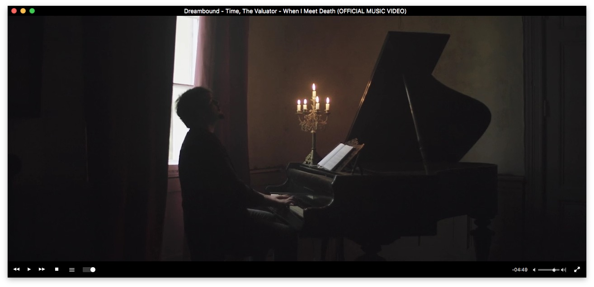

# Black-VLC-Mac
A black theme for VLC for Mac

This is the really lazy realization of a non-ugly VLC skin for macOS (since the skinning system only is for Windows).

## Preview

## Installation

Just copy everythng from the 'files' folder to /Applications/VLC/Contents/Resources and set your VLC skin to dark. Done.
